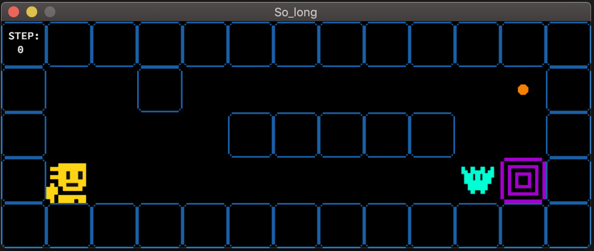

# So Long

In this project I developed a game in C language using the minilibx library.

<br>

## Project Details

**A two-dimensional map is given** *(must have .ber extension)*.

There should be one **P** *(Player)*, **M** *(Enemy)* and **E** *(Exit)* in this map. **C** means food. The program will visualize the map you have entered and will open in a playable state. *(0 means empty and 1 means wall.)*

<br>

## Project Images




<br>

## Sample Map 
> maps/map1.ber
```
1111111111111111111111111111111111
1E0000000000000C00000C000000000001
1010010100100000101001000000010101
1010010010101010001001000000010101
1P0000000C00C000000000000M000000C1
1111111111111111111111111111111111
```
